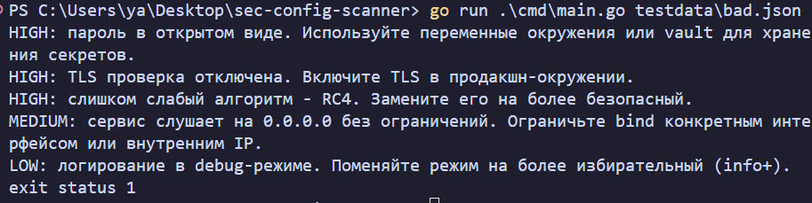
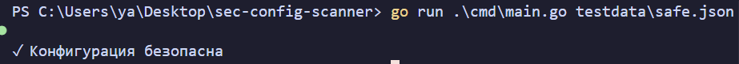
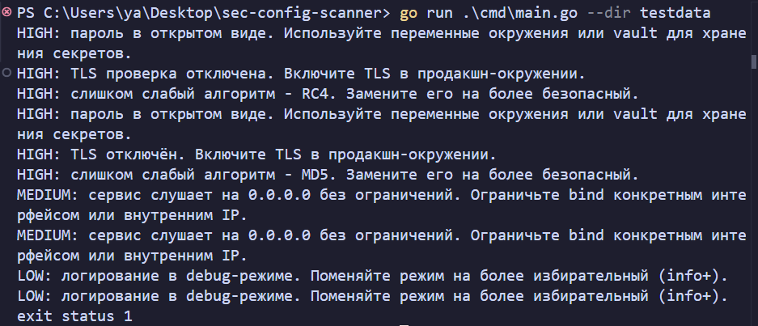
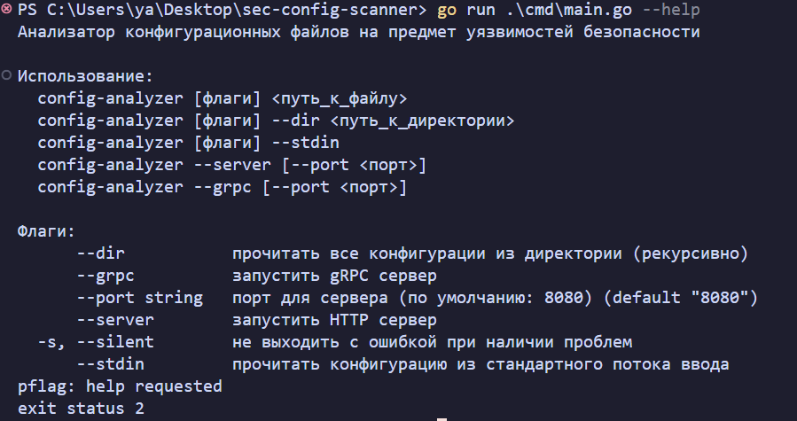
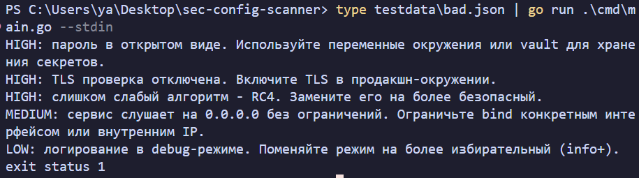
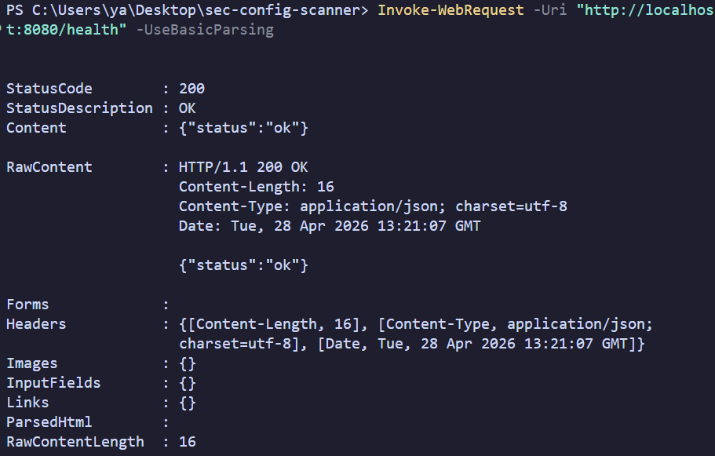
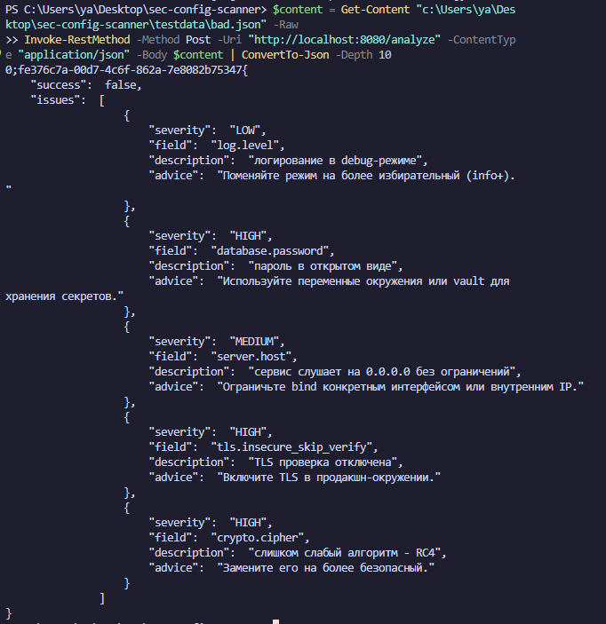
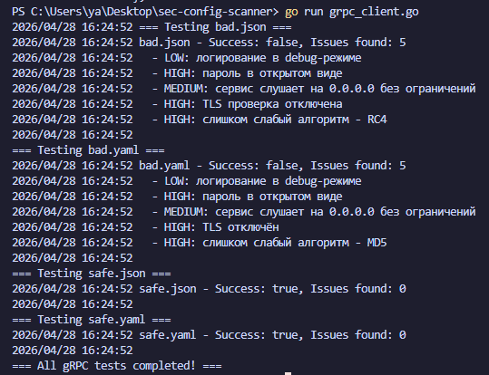

# Config Analyzer

Анализатор конфигурационных файлов (JSON/YAML) на предмет уязвимостей и проблем безопасности.

## Установка

### С помощью Go (рекомендуется)

```bash
go install github.com/ya/sec-config-scanner@latest
```

### Сборка из исходников

```bash
git clone https://github.com/ya/sec-config-scanner.git
cd sec-config-scanner
go build -o config-analyzer ./cmd/main.go
```

### Docker

```bash
docker build -t config-analyzer .
docker run --rm config-analyzer --help
```

## Использование

### Анализ файла

```bash
config-analyzer config.json
config-analyzer config.yaml
```

### Анализ из stdin

```bash
cat config.json | config-analyzer --stdin
```

### Рекурсивный анализ директории

```bash
config-analyzer --dir /path/to/configs
```

### Флаг silent

```bash
# Без флага -s: выход с кодом 1, если найдены проблемы
config-analyzer config.json

# С флагом -s: вывод результатов, но выход с кодом 0
config-analyzer --silent config.json
```

## HTTP Server

### Запуск

```bash
config-analyzer --server --port 8080
```

### Анализ через HTTP API

**JSON:**

```bash
curl -X POST http://localhost:8080/analyze \
  -H "Content-Type: application/json" \
  -d '{
    "data": {
      "log": {"level": "debug"},
      "password": "secret123"
    }
  }'
```

**YAML:**

```bash
curl -X POST http://localhost:8080/analyze \
  -H "Content-Type: application/yaml" \
  -d 'data:
  log:
    level: debug
  password: secret123'
```

### Health check

```bash
curl http://localhost:8080/health
```

## gRPC Server

### Запуск

```bash
config-analyzer --grpc --port 9090
```

### Пример клиента

Запуск встроенного клиента для тестирования:

```bash
# Запуск gRPC сервера
config-analyzer --grpc --port 9090

# Запуск клиента (в другом терминале)
go run ./cmd/grpc-client/main.go
```

## Демонстрация работы

### CLI режим



**Анализ файла с проблемами:**
```bash
config-analyzer testdata/bad.json
```

**Результат:**
```
HIGH: пароль в открытом виде. Используйте переменные окружения или vault для хранения секретов.
HIGH: TLS проверка отключена. Включите TLS в продакшн-окружении.
HIGH: слишком слабый алгоритм - RC4. Замените его на более безопасный.
MEDIUM: сервис слушает на 0.0.0.0 без ограничений. Ограничьте bind конкретным интерфейсом или внутренним IP.
LOW: логирование в debug-режиме. Поменяйте режим на более избирательный (info+).
```



**Анализ безопасной конфигурации:**
```bash
config-analyzer testdata/safe.json
```

**Результат:**
```
✓ Конфигурация безопасна
```

---

### CLI режим — анализ директории



**Рекурсивный анализ:**
```bash
config-analyzer --dir testdata
```

---

### CLI режим — помощь



**Справка:**
```bash
config-analyzer --help
```

---

### CLI режим — stdin



**Анализ из stdin:**
```bash
cat config.json | config-analyzer --stdin
```

---

### HTTP Server



**Health check:**
```bash
curl http://localhost:8080/health
```

**Ответ:**
```json
{"status":"ok"}
```



**Анализ через API:**
```bash
curl -X POST http://localhost:8080/analyze \
  -H "Content-Type: application/json" \
  -d '{"data": {"log": {"level": "debug"}}'
```

---

### gRPC Server



**Запуск сервера и тестирование через клиента:**
```bash
# Запуск gRPC сервера
config-analyzer --grpc --port 9090

# Запуск клиента (в другом терминале)
go run ./cmd/grpc-client/main.go
```

---

## Правила анализа

### 1. Debug Log (LOW)

Проверяет уровень логирования.

**Проблема:** `log.level: debug` или аналогичные поля.

**Совет:** Поменяйте режим на более избирательный (info+).

---

### 2. Plaintext Password (HIGH)

Ищет пароли в открытом виде.

**Проверяемые поля:** `password`, `passwd`, `pwd`, `secret`.

**Исключения:** Хеши (MD5, SHA1, SHA256, SHA512, bcrypt) и переменные окружения (`$VAR`).

**Пример проблемы:**

```yaml
database:
  password: "secret123"  # HIGH
```

**Пример безопасной конфигурации:**

```yaml
database:
  password: "$DB_PASSWORD"  # OK - переменная окружения
  # или
  password: "2cf24dba5fb0a30e26e83b2ac5b9e29e1b161e5c1fa7425e73043362938b9824"  # OK - SHA256
```

**Совет:** Используйте переменные окружения или vault для хранения секретов.

---

### 3. Bind All (MEDIUM)

Проверяет, что сервис не слушает на всех интерфейсах.

**Проблема:** `host: 0.0.0.0` или аналогичные поля.

**Совет:** Ограничьте bind конкретным интерфейсом или внутренним IP.

---

### 4. TLS Disabled (HIGH)

Проверяет настройки TLS/SSL.

**Проблемы:**

- `tls.enabled: false`
- `tls.insecure_skip_verify: true` или аналогичные

**Совет:** Включите TLS в продакшн-окружении.

---

### 5. Weak Algorithm (HIGH)

Проверяет использование слабых алгоритмов шифрования и хеширования.

**Проверяемые поля:** `algorithm`, `algo`, `cipher`, `digest`, `hash`, `encryption`.

**Запрещённые алгоритмы:** MD5, SHA1, SHA-1, DES, 3DES, RC4, NULL.

**Пример проблемы:**

```json
{
  "crypto": {
    "algorithm": "md5"  # HIGH
  }
}
```

**Пример безопасной конфигурации:**

```json
{
  "crypto": {
    "algorithm": "sha256"  # OK
  }
}
```

**Совет:** Используйте SHA-256 или выше.

---

### 6. File Permissions (MEDIUM)

Проверяет права доступа к файлам, указанным в конфигурации.

**Только при использовании `--dir` или stdin.**

**Проблема:** Файлы с правами `mode & 0077 != 0` (чтение/запись/выполнение для "others").

**Совет:** Ограничьте права доступа (рекомендуется 0600 или 0640).

---

## Разработка

### Установка зависимостей

```bash
go mod download
```

### Тесты

```bash
go test ./...
```

### Линтер

```bash
golangci-lint run ./...
```

### Сборка

```bash
make build
```

### Цели Makefile

- `make build` — собирает бинарник
- `make test` — запускает тесты
- `make lint` — запускает golangci-lint
- `make docker` — собирает Docker-образ
- `make run` — запускает бинарник
- `make run-server` — запускает HTTP сервер на порту 8080
- `make run-grpc` — запускает gRPC сервер на порту 8080
- `make proto` — пересобирает proto-файлы

---

## Severity

| Severity | Описание                                                   |
| -------- | ---------------------------------------------------------- |
| HIGH     | Критические уязвимости, требующие немедленного исправления |
| MEDIUM   | Потенциальные проблемы безопасности                        |
| LOW      | Рекомендации по улучшению                                  |

---

## Docker

### Сборка образа

```bash
docker build -t config-analyzer .
```

### Запуск анализа файла

```bash
docker run --rm -v $(pwd):/app -w /app config-analyzer config.json
```

### Запуск HTTP сервера

```bash
docker run --rm -p 8080:8080 config-analyzer --server
```

---

## Примеры конфигураций

### Проблемная конфигурация (пример config.json)

```json
{
  "log": {
    "level": "debug"
  },
  "database": {
    "host": "0.0.0.0",
    "password": "secret123",
    "ssl": {
      "insecure_skip_verify": true,
      "enabled": false
    }
  },
  "crypto": {
    "algorithm": "md5"
  }
}
```

**Результат:**

```
HIGH: пароль в открытом виде (database.password). Используйте переменные окружения или vault для хранения секретов.
HIGH: TLS проверка отключена (database.ssl.insecure_skip_verify). Включите TLS в продакшн-окружении.
HIGH: TLS отключён (database.ssl.enabled). Включите TLS в продакшн-окружении.
HIGH: слабый алгоритм — md5 (crypto.algorithm). Используйте SHA-256 или выше.
MEDIUM: сервис слушает на 0.0.0.0 без ограничений (database.host). Ограничьте bind конкретным интерфейсом или внутренним IP.
LOW: логирование в debug-режиме (log.level). Поменяйте режим на более избирательный (info+).
```

---

## Лицензия

MIT

---

## Дополнительные ресурсы

- [Go Best Practices](https://go.dev/doc/effective_go)
- [CIS Benchmarks](https://www.cisecurity.org/benchmark)
- [OWASP ASVS](https://owasp.org/www-project-application-security-verification-standard)
